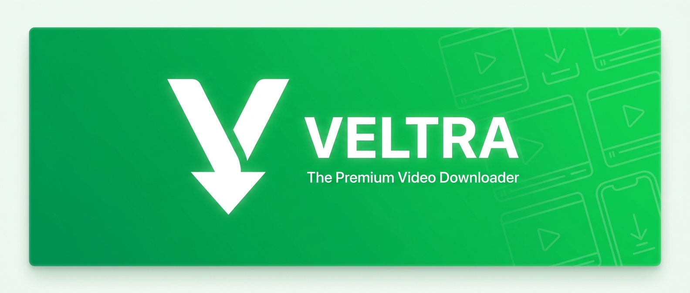
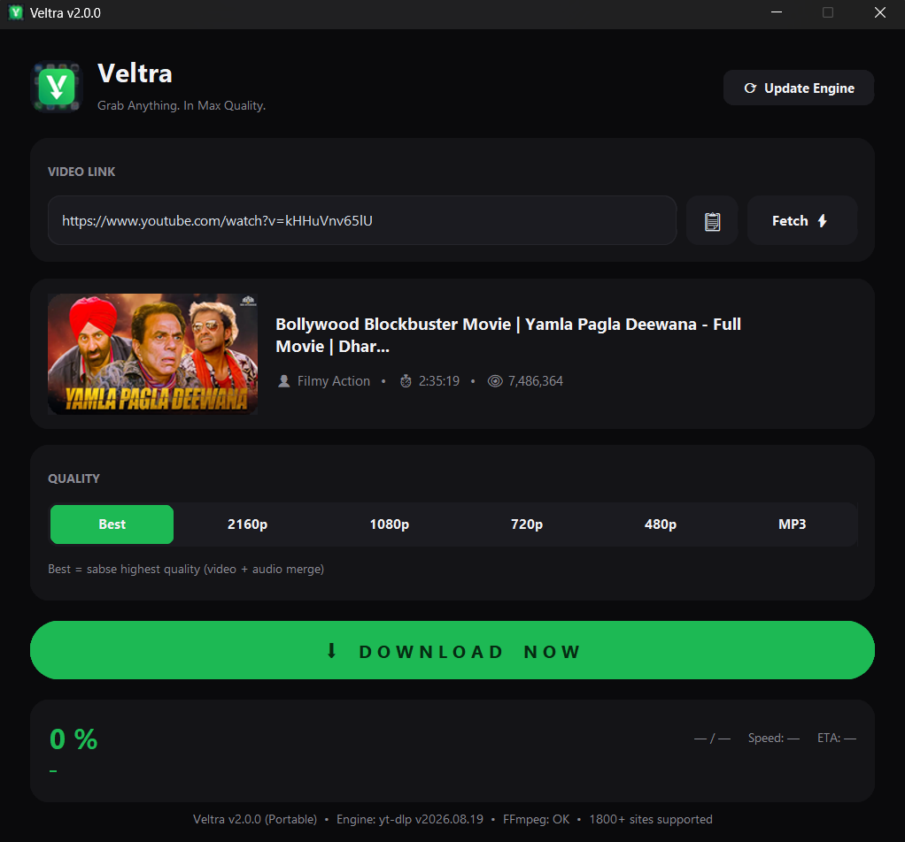

<p align="center">

</p>

<h1 align="center">⚡ VELTRA</h1>

<p align="center"><strong>Grab Anything. In Max Quality.</strong></p>

<p align="center">A sleek, lightning-fast video downloader for 1800+ websites — YouTube, Dailymotion, Facebook, TikTok, Instagram & more.</p>

<p align="center">


</p>

<p align="center">
<a href="#-features">Features</a> •
<a href="#-installation">Installation</a> •
<a href="#-usage">Usage</a> •
<a href="#-building-the-exe">Build EXE</a> •
<a href="#-contributing">Contributing</a> •
<a href="#-license">License</a>
</p>

> 📌 **Versions:** `Veltra.py` = original edition (pure downloader) • `Veltra_v2.1.1.py` = latest edition (adds Download History, English Subtitles & Clipboard Detection)

---

## 📸 Screenshot

<p align="center">

</p>

<p align="center"><em>Veltra — Spotify-inspired dark interface with live video preview & real-time progress</em></p>

---

## ✨ Features

| Feature                            | Description                                                                                          |
| ---------------------------------- | ---------------------------------------------------------------------------------------------------- |
| 🎯**1800+ Supported Sites**  | YouTube, Dailymotion, Facebook, TikTok, Instagram, Twitter/X, Vimeo, Reddit & more                   |
| 🖼**Live Video Preview**     | Paste a link and instantly see thumbnail, title, channel & views                                     |
| 🏆**Highest Quality Engine** | Up to 4K (2160p) with automatic video + audio merging                                                |
| 🎵**MP3 Extraction**         | Convert any video to audio with one click                                                            |
| 🚀**8x Parallel Downloads**  | 4-5x faster fragmented downloading                                                                   |
| 📊**Real-Time Progress**     | Live speed, ETA, size & percentage                                                                   |
| 📁**Directory Picker**       | Choose save location on every download                                                               |
| 🌓**Premium Dark UI**        | Spotify-inspired interface built with CustomTkinter                                                  |
| 🔄**Self-Updating Engine**   | One-click yt-dlp engine update from inside the app                                                   |
| 📦**Portable EXE**           | Single`.exe` file, no Python installation required                                                 |
| 🎬**English Subtitles (CC)** | Auto-download & auto-translate subtitles to English (.srt) for any video — like YouTube's CC button |
| 🕘**Download History**       | Every download remembered — replay or open the folder in one click                                  |
| 📋**Clipboard Detection**    | Copy a link anywhere — Veltra detects and fetches it instantly                                      |
| ⚡**Instant Cancel**         | Downloads stop immediately on cancel — zero freezing                                                |
| ❌**Cancel Anytime**         | Stop downloads mid-way with one click                                                                |

---

## 🛠 Tech Stack

| Component        | Technology                                                     |
| ---------------- | -------------------------------------------------------------- |
| Language         | Python 3.9+                                                    |
| Download Engine  | [yt-dlp](https://github.com/yt-dlp/yt-dlp)                      |
| GUI Framework    | [CustomTkinter](https://github.com/TomSchimansky/CustomTkinter) |
| Media Processing | FFmpeg (via imageio-ffmpeg)                                    |
| Image Handling   | Pillow                                                         |
| Packaging        | PyInstaller                                                    |

---

## 📥 Installation

### Option 1 — Ready-Made EXE *(Recommended for users)*

1. Download `Veltra.exe` from the [**Releases**](https://github.com/shahzain112/Veltra/releases) page
2. Double-click and run — no installation needed!

> ⚠️ **Note:** If Windows SmartScreen shows a warning, click **"More info" → "Run anyway"** — this happens because the app is not code-signed yet.

### Option 2 — Run from Source *(Developers)*

**Step 1:** Clone the repository

```bash
git clone https://github.com/shahzain112/Veltra.git
cd Veltra
```

**Step 2:** Install dependencies

```bash
pip install -r requirements.txt
```

**Step 3:** Run the app

```bash
python Veltra.py
```

---

## 🚀 Usage

1. **Copy** any video link — Veltra auto-detects it from the clipboard! *(or paste manually)*
2. Click **Fetch ⚡** — see the live preview
3. **Select quality** — Best / 2160p / 1080p / 720p / 480p / MP3
4. Toggle **CC English Subtitles** — a translated `.srt` file saves next to your video
5. Hit **DOWNLOAD** — choose your folder and enjoy!
6. Revisit anything from the **🕘 History** page — one-click open

> **Paste → Fetch → Download. That's it.** ⚡

---

## 📦 Building the EXE

Want to build your own portable `.exe`?

**Easy way (inside the app):**

1. Run the app from source: `python Veltra.py`
2. Click the 🔨 **Create EXE** button inside the app
3. Wait 3-6 minutes — your `dist/Veltra.exe` will be ready!

**Manual way (CLI):**

```bash
pyinstaller --noconfirm --clean --onefile --noconsole --name Veltra --icon Veltra_icon.ico --collect-all customtkinter --collect-all yt_dlp --collect-all imageio_ffmpeg Veltra.py
```

---

## 📁 Project Structure

```javascript
Veltra/
├── screenshots/
│   └── app.png             # App screenshot for README
├── .gitignore
├── LICENSE                 # MIT License
├── README.md               # This file
├── requirements.txt        # Python dependencies
├── Veltra.py               # Original edition — pure downloader
├── Veltra_v2.1.1.py        # Latest edition — adds History, Subtitles & Clipboard detection
├── Veltra_icon.ico         # App icon
├── Veltra.jpg              # App icon (square image)
└── VeltraBanner.jpg        # README banner image
```

---

## 🤝 Contributing

Contributions are welcome and appreciated! 🎉

### How to Contribute

1. **Fork** the repository
2. **Create** your feature branch

```bash
git checkout -b feature/AmazingFeature
```

3. **Commit** your changes

```bash
git commit -m "Add some AmazingFeature"
```

4. **Push** to the branch

```bash
git push origin feature/AmazingFeature
```

5. **Open a Pull Request** ✅

### Ideas You Can Work On

- [ ] Playlist / batch downloads
- [ ] Light theme
- [ ] Multi-language support (Urdu, Arabic...)
- [ ] Built-in update checker for releases
- [ ] Built-in media player
- [ ] AI auto-subtitle generation (speech-to-text for any video file)

---

## ⚠️ Disclaimer

Veltra is a free, open-source tool intended for downloading **publicly available content for personal use only**. Please respect the Terms of Service of the platforms you download from, and do not redistribute copyrighted content.

---

## 📄 License

This project is licensed under the **MIT License** — see the [LICENSE](LICENSE) file for details.

---

<p align="center">
<strong>⭐ Star this repo if you find it useful!</strong>
</p>

<p align="center">
Made with by <a href="https://github.com/shahzain112">Shahzain Ahmed</a>
</p>

<p align="center">
<strong>Veltra — Grab Anything. In Max Quality.</strong>
</p>
